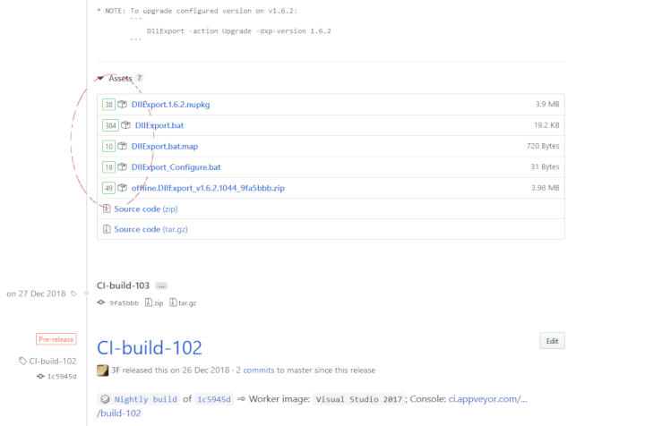
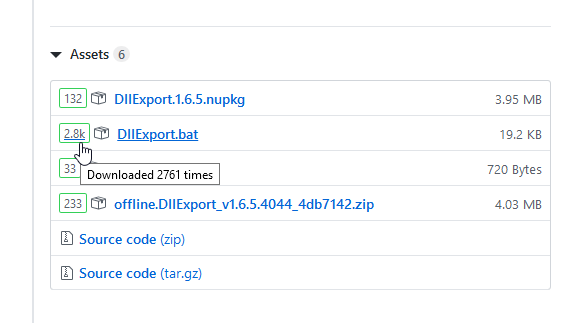

## [GhrMeter.user.js](https://github.com/3F/GhrMeter.user.js)

An user script to show download counter for each attachment from 'Releases' page on GitHub.com

**GhrMeter** has been extracted from my [:: sandbox ::](https://github.com/3F/sandbox) (GitHubReleasesCount). Still under the MIT license.

[](https://ci.appveyor.com/project/3Fs/ghrmeter-user-js/branch/master)
[](https://github.com/3F/GhrMeter.user.js/releases/latest)
[](https://github.com/3F/GhrMeter.user.js/blob/master/License.txt)

**Download:** [GhrMeter.user.js](https://3F.github.io/GhrMeter.user.js/releases/latest/)

* [/releases](https://github.com/3F/GhrMeter.user.js/releases) [ [latest](https://github.com/3F/GhrMeter.user.js/releases/latest) ]

## License

The [MIT License (MIT)](https://github.com/3F/GhrMeter.user.js/blob/master/License.txt)

```
Copyright (c) 2017-2019  Denis Kuzmin < entry.reg@gmail.com > :: github.com/3F
```

[[ ☕ ]](https://3F.github.io/Donation/)

### How to use

As the most easy way, you need to have an userscript manager like Greasemonkey, Tampermonkey, and so on.

Then, either just click **[here](https://3F.github.io/GhrMeter.user.js/releases/latest/)** and follow the installation instructions from your userscript manager.

**Or** add this manually(again via userscript manager), **or** use any other your favorite way. It does not matter because this code will work immediately after loading into DOM.

Enjoy!

### Social

* https://plus.google.com/+DenisKuzmin3F/posts/bGrH3kJTUNm





## Changelog

* [changelog.txt](./changelog.txt)