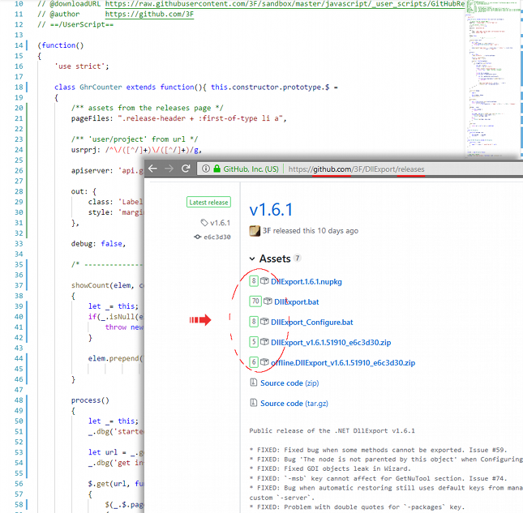

## [GhrMeter.user.js](https://github.com/3F/GhrMeter.user.js)

An user script to show download counter for each attachment from 'Releases' page on GitHub.com

Extracted from my [:: sandbox ::](https://github.com/3F/sandbox) Enjoy.

**Download:** [/releases](https://github.com/3F/GhrMeter.user.js/releases) [ [latest](https://github.com/3F/GhrMeter.user.js/releases/latest) ]

## License

The [MIT License (MIT)](https://github.com/3F/GhrMeter.user.js/blob/master/License.txt)

```
Copyright (c) 2017-2019  Denis Kuzmin < entry.reg@gmail.com > :: github.com/3F
```

[[ ☕ ]](https://3F.github.io/Donation/)

### Social

* https://plus.google.com/+DenisKuzmin3F/posts/bGrH3kJTUNm



## Changelog

* [changelog.txt](./changelog.txt)