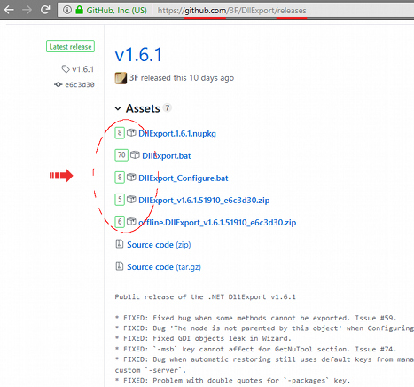

## [GhrMeter.user.js](https://github.com/3F/GhrMeter.user.js)

An user script to show statistics for each attachment from 'Releases' page on GitHub.com

Extracted from my [:: sandbox ::](https://github.com/3F/sandbox) *(known as a GitHubReleasesCount)* Under the MIT license 🎉 [Enjoy!](https://github.com/3F)

[](https://ci.appveyor.com/project/3Fs/ghrmeter-user-js-github/branch/master)
[](https://github.com/3F/GhrMeter.user.js/releases/latest)
[](https://github.com/3F/GhrMeter.user.js/blob/master/License.txt)

**Download:** [GhrMeter.user.js](https://3F.github.io/GhrMeter.user.js/releases/latest/)

* Minified + **Non**-minified [/releases](https://github.com/3F/GhrMeter.user.js/releases) [ [latest](https://github.com/3F/GhrMeter.user.js/releases/latest) ]
* *[Changelog](./changelog.txt)*

## License

The [MIT License (MIT)](https://github.com/3F/GhrMeter.user.js/blob/master/License.txt)

```
Copyright (c) 2017-2020  Denis Kuzmin < x-3F@outlook.com > GitHub/3F
```

[ [ ☕ Donate ](https://3F.github.com/Donation/) ]

### How to install

As the most easy way, you need to have an userscript manager like Greasemonkey, Tampermonkey, and so on. Click **[here](https://3F.github.io/GhrMeter.user.js/releases/latest/)** and follow the installation instructions from your userscript manager.

**Or** add manually as you prefer. It does not matter "how" because this code will work immediately after loading into DOM.

### Screenshots

Feb 2020: 


Aug 2018: 


